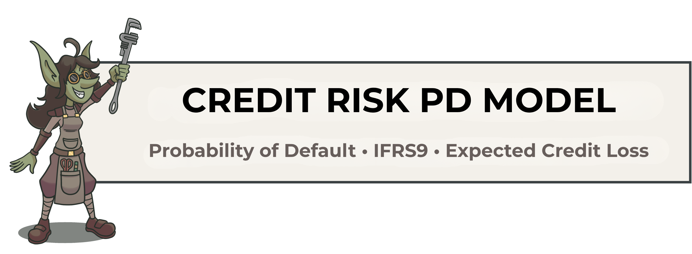
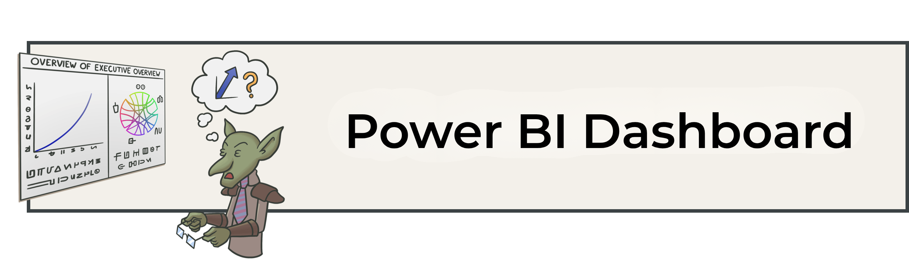
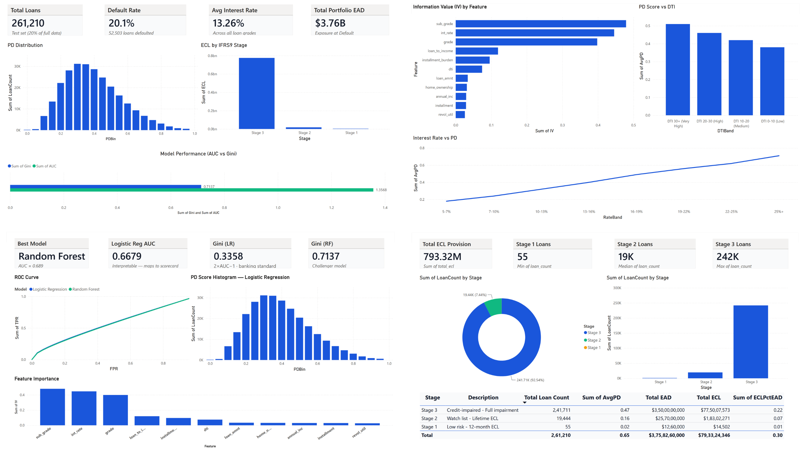
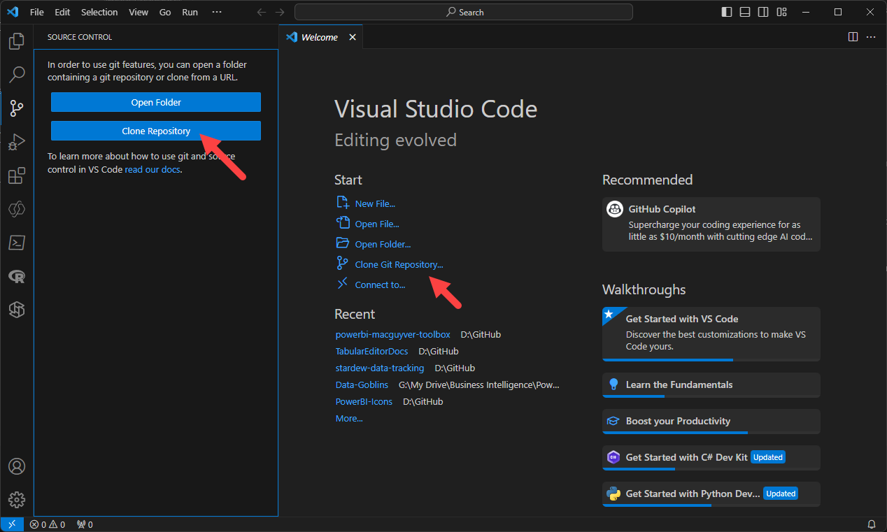
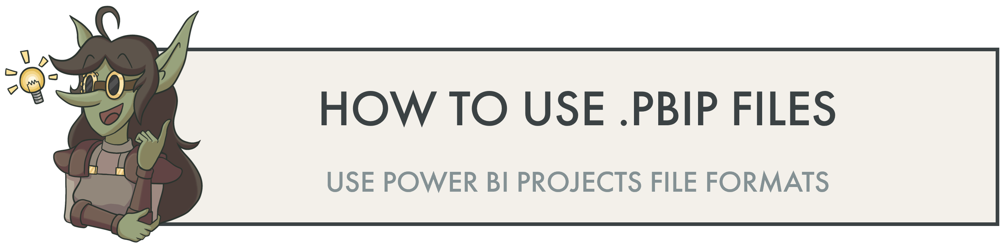
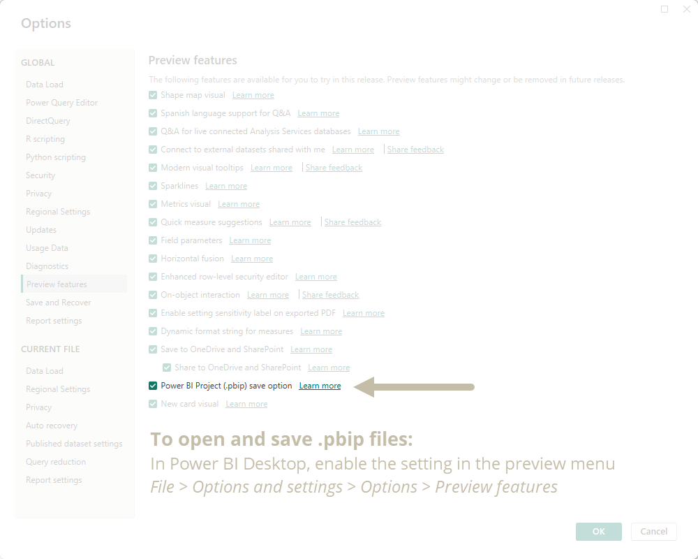

<div align="center">



**Probability of Default Modelling with IFRS9 Staging & Expected Credit Loss Estimation**

[](https://python.org)
[](https://scikit-learn.org)
[](https://powerbi.microsoft.com)
[](LICENSE)
[]()

---

*End-to-end machine learning pipeline for Probability of Default prediction, IFRS9 staging, Expected Credit Loss estimation, and interactive Power BI analytics.*

</div>

---


## ✨ Project Features

| Feature | Description |
|---------|-------------|
| 🧹 **Production-grade data cleaning** | Handles 1.2GB LendingClub dataset, missing values, type correction |
| 📊 **WoE / IV feature selection** | Industry-standard credit risk feature ranking |
| ⚖️ **SMOTE class balancing** | Handles the ~80/20 non-default/default imbalance |
| 🤖 **Two ML models** | Logistic Regression (scorecard) + Random Forest (challenger) |
| 📈 **Full evaluation suite** | AUC, Gini, KS statistic, confusion matrix, ROC curve |
| 🏦 **IFRS9 staging** | Assigns every loan to Stage 1/2/3 with ECL calculation |
| 📉 **Power BI dashboard** | 4-page interactive dashboard connected to model output |
| 🌐 **Web application** | Responsive prediction interface with Chart.js visualisations |
| 💼 **Business framing** | Revenue-at-risk quantification and retention ROI calculation |

---

## 🏗 Project Architecture

```
┌─────────────────────────────────────────────────────────────────────┐
│                     CREDIT RISK PD MODEL PIPELINE                   │
└─────────────────────────────────────────────────────────────────────┘

  ┌──────────────┐     ┌──────────────┐     ┌──────────────────────┐
  │  RAW DATA    │───▶│  DATA PREP   │────▶│  FEATURE ENGINEERING │
  │              │     │              │     │                      │
  │ LendingClub  │     │ • Filter     │     │ • WoE / IV scoring   │
  │ 2.2M loans   │     │   loan_status│     │ • Bin continuous vars│
  │ 150 columns  │     │ • Fix types  │     │ • Encode categoricals│
  │ 1.2 GB CSV   │     │ • Handle     │     │ • Engineer new feats │
  └──────────────┘     │   missings   │     │ • Select top 11 feats│
                       │ • SMOTE      │     └──────────┬───────────┘
                       └──────────────┘                │
                                                       ▼
  ┌──────────────┐     ┌──────────────┐     ┌──────────────────────┐
  │  IFRS9       │◀───│  MODEL       │◀────│  TRAIN / TEST SPLIT  │
  │  STAGING     │     │  OUTPUT      │     │                      │
  │              │     │              │     │ • 80% train          │
  │ Stage 1 <5%  │     │ • PD score   │     │ • 20% test           │
  │ Stage 2 5-20%│     │ • Risk tier  │     │ • Stratified         │
  │ Stage 3 >20% │     │ • AUC: 0.689 │     │ • StandardScaler     │
  │              │     │ • Gini: 0.378│     └──────────────────────┘
  └──────┬───────┘     └──────────────┘
         │
         ▼
  ┌──────────────┐     ┌──────────────┐     ┌──────────────────────┐
  │  ECL CALC    │────▶│  POWER BI    │     │  WEB APPLICATION     │
  │              │     │  DASHBOARD   │     │                      │
  │ ECL = PD     │     │              │     │ • Prediction form    │
  │   × LGD(45%) │     │ • Overview   │     │ • PD gauge meter     │
  │   × EAD      │     │ • Risk seg.  │     │ • IFRS9 output       │
  │              │     │ • Model perf │     │ • Chart.js visuals   │
  │ $793M total  │     │ • IFRS9 page │     │ • Flask-ready API    │
  └──────────────┘     └──────────────┘     └──────────────────────┘
```

---

## 📁 Folder Structure

```
credit_risk_pd/
│
├── 📂 assets/                 # All readme Screenshots, icons, images
├── 📂 data/
│   ├── raw/                    # Original CSV — never modified
│   │   └── loan.csv            # Put Original LendingClub dataset (1.2 GB)
│   └── processed/              # Cleaned outputs from notebooks
│       ├── scored_loans.csv         # Test set with PD scores + IFRS9 stage
│       ├── scored_loans_slim.csv    # Reduced file for Power BI (<10MB)
│       ├── ifrs9_stage_summary.csv  # 3-row IFRS9 summary table
│       ├── iv_scores.csv            # IV scores per feature
│       └── model_performance.csv    # AUC and Gini for both models
│
├── 📂 notebooks/
│   └── Credit_RIsk_PD.ipynb     # Model training, evaluation, IFRS9, export
│
├── 📂 website/                 # Standalone web application
│   └── index.html              # Main page + prediction interface
│   
├── 📂 dashboard/
│   └── credit_risk_pd.pbix     # Power BI Desktop file
│
│
├── requirements.txt            # All Python dependencies
├── README.md                   # This file
└── LICENSE                     # MIT License
```

---

## 📊 Results

| Metric | Value |
|--------|-------|
| Dataset size | 2.2M loans (1.2 GB) → 261,210 test set |
| Features selected (IV > 0.02) | 11 |
| Logistic Regression AUC | 0.6679 |
| Logistic Regression Gini | 0.3358 |
| Random Forest AUC | **0.6889** |
| Random Forest Gini | **0.3779** |
| Stage 1 loans (PD < 5%) | 55 (0.02%) |
| Stage 2 loans (PD 5–20%) | 19,444 (7.4%) |
| Stage 3 loans (PD > 20%) | 241,711 (92.5%) |
| Total ECL provision | **$793 million** |

---


## 📊 Power BI Dashboard

The Power BI dashboard (`credit_risk_pd.pbix`) connects directly to the 4 output CSVs and uses custom DAX measures and a bespoke IFRS9-aligned colour theme.

### Page 1 — Portfolio Overview

**Audience:** Senior management / CRO  
**Purpose:** High-level health of the loan portfolio at a glance

- **KPI Cards:** Total loans (261,210), Default rate (20.1%), Avg interest rate (13.26%), Total EAD ($3.76B)
- **PD Score Histogram:** Distribution of predicted PD scores, colour-coded by IFRS9 stage (green/amber/red)
- **ECL Bar Chart:** Expected credit loss by stage, showing Stage 3 dominates at $775M
- **Model Performance Cards:** LR AUC 0.668, RF AUC 0.689

### Page 2 — Risk Segmentation

**Audience:** Risk analysts / underwriters  
**Purpose:** Understand which loan characteristics drive default

- **IV Bar Chart:** Feature importance ranking — sub_grade, int_rate, and grade are the top 3 predictors
- **Default Rate by Interest Rate Band:** Line chart showing default rate rising steeply from 5–7% to 25%+ bands
- **Risk tier distribution:** High / Medium / Low risk customer segmentation

### Page 3 — Model Performance

**Audience:** Data science team / model validators  
**Purpose:** Technical evaluation of both models

- **AUC / Gini Comparison:** Side-by-side bar chart for Logistic Regression vs Random Forest
- **PD Histogram:** Reused from Page 1 for context
- **Feature Importance Chart:** IV scores for all 11 selected features

### Page 4 — IFRS9 Staging

**Audience:** Finance / accounting / auditors  
**Purpose:** Regulatory provisioning view

- **Stage Donut Chart:** Loan count split by Stage 1/2/3 (green/amber/red)
- **ECL Bar Chart:** Provision amount by stage in $M
- **Summary Table:** Full IFRS9 table with loan count, avg PD, total EAD, total ECL, and ECL as % of EAD per stage



---

## 💡 To use these templates
Templates are provided either as Power BI Desktop (.pbix) or [Power BI projects (.pbip)](https://learn.microsoft.com/en-us/power-bi/developer/projects/projects-overview) files. I recommend that you use the .pbip format. 


### How to clone a repository by using Git
To use these templates, I recommend that you _clone_ (or copy) this Git repo to your local machine. If you're unfamiliar with Git, cloning allows you to ensure you have a syncronized local copy of the repository. You use a tool like VS Code to open the folder, check for changes, and sync to get the latest updates. To clone the Git repo:

1. __Install [Git](https://git-scm.com/download/win).__ Typically, you want to use the 64-bit Git for Windows Setup.
2. __Download a graphical user interface (GUI) to manage Git, like [GitHub Desktop](https://desktop.github.com/) or [VS Code](https://code.visualstudio.com/).__ You can also manage it from the command line, but if you're new to Git, this isn't recommended. I recommend that you [download and install VS Code](https://code.visualstudio.com/), since it's used for other code authoring experiences in Power BI.
3. __Create a [GitHub account](https://github.com/signup).__ Follow the steps to validate your account and set up multi-factor authentication.
4. __Link your GitHub account to the GUI you downloaded.__ This differs depending on the tool you used. Generally, you should just follow the user interface's instructions; in [VS Code](https://code.visualstudio.com/docs/sourcecontrol/github) you sign in via the Source Control tab or GitHub extension.
5. __Clone the repository.__ In the GUI, you should select an option "clone repository". From here, you can enter the HTTPS URL. You can also initiate this from GitHub, itself, via the _code_ button.

> <br>
> Use this URL when cloning the repo: https://github.com/ManishAttry/Credit_Risk_PD/
> <br><br>

<br>



### Create a virtual environment

A virtual environment isolates this project's dependencies from your global Python installation. This prevents version conflicts across projects.

**Windows:**
```bash
# Create the virtual environment in a folder called .venv
python -m venv .venv

# Activate it — your terminal prompt will show (.venv) when active
.venv\Scripts\activate

# Install all required packages from requirements.txt
pip install -r requirements.txt
```

This installs: pandas, numpy, matplotlib, seaborn, scikit-learn, imbalanced-learn, xgboost, shap, notebook, openpyxl, and kagglehub.

### Download the dataset

Option A — Kaggle CLI (recommended):
```bash
# Install Kaggle CLI (if not already installed)
pip install kaggle

# Download LendingClub dataset (~1.2 GB)
kaggle datasets download -d wordsforthewise/lending-club -p data/raw/ --unzip
```

Option B — Manual download:
1. Go to https://www.kaggle.com/datasets/wordsforthewise/lending-club
2. Click Download
3. Extract `loan.csv` to `data/raw/`

Open the notebooks in order:
`Credit_RIsk_PD.ipynb`




### How to enable and use .pbip files

1. Open Power BI Desktop (~May 2023 version or later)
2. Open the 'File' menu
3. Navigate to _Options and settings_ and then _Options_
4. Enable the preview feature _Power BI Project (.pbip) save option
5. Restart Power BI Desktop
6. Open the .pbip files in Power BI Desktop



__I recommend the .pbip format for templates for the following reasons:__
- Lightweight sharing of report + model metadata.
- Report metadata allows you to programmatically modify the templates before opening them.
- Track changes of the individual objects and formatting in the GitHub repo.

<br><br>

## 👤 Author

**Manish Kumar**  
MBA — Business Economics | Department of Business Economics, University of Delhi (2027)  

[](https://linkedin.com/in/manish-kumarrr)
[](https://github.com/ManishAttry)
[](mailto:your.email@example.com)

---

<div align="center">
 
*If this project helped you, please ⭐ the repository*

</div>


------------------------------------------------------------------------


	
