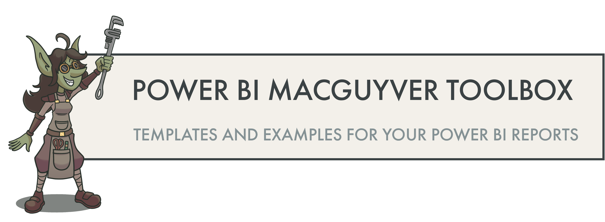
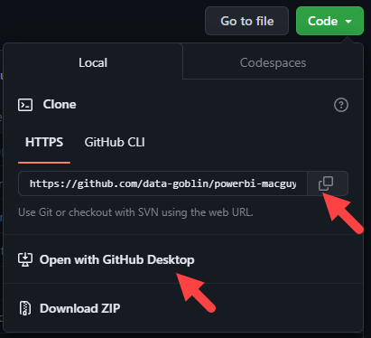

# Credit Risk PD Prediction

## Overview

This project predicts the Probability of Default (PD) using machine learning and presents business insights through a Power BI dashboard.

## Features

* Data Cleaning
* Feature Engineering
* Logistic Regression
* Random Forest
* ROC Curve
* IFRS 9 Staging
* Power BI Dashboard

## Tech Stack

* Python
* Pandas
* NumPy
* Scikit-learn
* Power BI

## Dashboard

(Add screenshots here)

## Results

* Logistic Regression AUC: 0.6679
* Random Forest AUC: 0.6889

--------------------------------------------------------

Power BI report visual templates and patterns. These templates are intended to help you solve specific visual requirements in your projects, or inspire you for your report design.

You can use them for free, but I'd appreciate that you please cite [data-goblins.com](https://www.data-goblins.com) if you do.

**SVG measure templates in the .pbix and .pbip files are contributed by Štěpán Rešl. Thanks Štěpán!**

## License
Please read and respect the [License Terms](LICENSE) if you will use these samples and examples in your content and work. It is not permitted to use this content or derivatives of this content in commercial works and trainings without the express consent of the author.
	
## 💡 To use these templates
Templates are provided either as Power BI Desktop (.pbix) or [Power BI projects (.pbip)](https://learn.microsoft.com/en-us/power-bi/developer/projects/projects-overview) files. I recommend that you use the .pbip format. 

### How to clone a repository by using Git
To use these templates, I recommend that you _clone_ (or copy) this Git repo to your local machine. If you're unfamiliar with Git, cloning allows you to ensure you have a syncronized local copy of the repository. You use a tool like VS Code to open the folder, check for changes, and sync to get the latest updates. To clone the Git repo:

1. __Install [Git](https://git-scm.com/download/win).__ Typically, you want to use the 64-bit Git for Windows Setup.
2. __Download a graphical user interface (GUI) to manage Git, like [GitHub Desktop](https://desktop.github.com/) or [VS Code](https://code.visualstudio.com/).__ You can also manage it from the command line, but if you're new to Git, this isn't recommended. I recommend that you [download and install VS Code](https://code.visualstudio.com/), since it's used for other code authoring experiences in Power BI.
3. __Create a [GitHub account](https://github.com/signup).__ Follow the steps to validate your account and set up multi-factor authentication.
4. __Link your GitHub account to the GUI you downloaded.__ This differs depending on the tool you used. Generally, you should just follow the user interface's instructions; in [VS Code](https://code.visualstudio.com/docs/sourcecontrol/github) you sign in via the Source Control tab or GitHub extension.
5. __Clone the repository.__ In the GUI, you should select an option "clone repository". From here, you can enter the HTTPS URL. You can also initiate this from GitHub, itself, via the _code_ button.

>  
> Use this URL when cloning the repo: https://github.com/data-goblin/powerbi-macguyver-toolbox.git
>   

 

### How to enable and use .pbip files

1. Open Power BI Desktop (~May 2023 version or later)
2. Open the 'File' menu
3. Navigate to _Options and settings_ and then _Options_
4. Enable the preview feature _Power BI Project (.pbip) save option
5. Restart Power BI Desktop
6. Open the .pbip files in Power BI Desktop

__I recommend the .pbip format for templates for the following reasons:__
- Lightweight sharing of report + model metadata.
- Report metadata allows you to programmatically modify the templates before opening them.
- Track changes of the individual objects and formatting in the GitHub repo.

  

### Core visuals - SVG measures
These use a combination of formatting options as well as SVG custom microvisualizations rendered as image URLs in the core visuals. 

**These SVG measure templates were created by Štěpán Rešl.**

  

## Remark
I don't consider myself a "dataviz person"; these comments are my subjective opinions and experience. I'm just sharing these templates because they might be helpful to others.